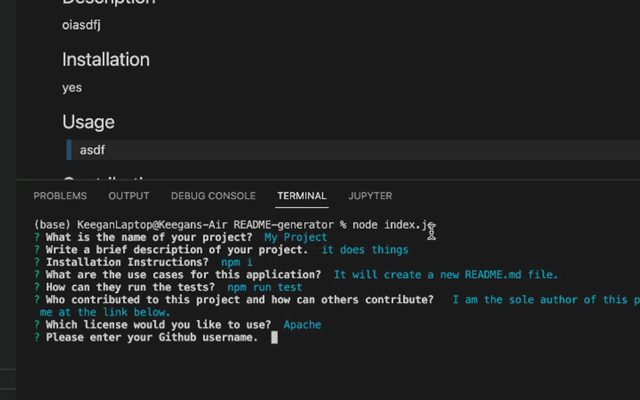

# README-Generator  

  - [Description](#description)
  - [Installation](#installation)
  - [Usage](#usage)
  - [Contributions](#contributions)
  - [Tests](#tests)
  - [Questions](#questions)
  - [License?](#license)
  - [Demo](#demo)

  ## Description
 
  A CLI program that will take the user through a series of prompts and then fill the responces into a README.md file.

  ## Installation

  run: npm install in your terminal to download the required dependencies.

  ## Usage

  > A quick and easy way to generate a README.md file for your project.

  ## Contributions
  
  I am the author. Please email me if you'd like to contribute.

  ## Tests

  npm run test

  ## Questions

  [My Github profile](https://github.com/guitarkeegan)

  Send me and email [here](mailto:keegananglim@gmail.com) to contact me directly.

  ## License
  This project is licensed under the [MIT License](https://choosealicense.com/licenses/mit/) - click the link to read the license.

  ## Demo

  [Walkthrough of how it works](https://drive.google.com/file/d/1_jbFloUFTB2IcthXYxrFyHzfvcR3nPyr/view?usp=sharing)

  
  
 